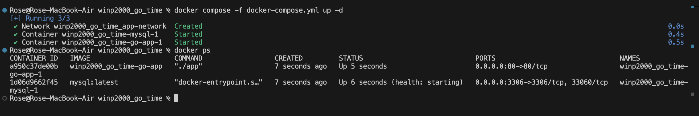
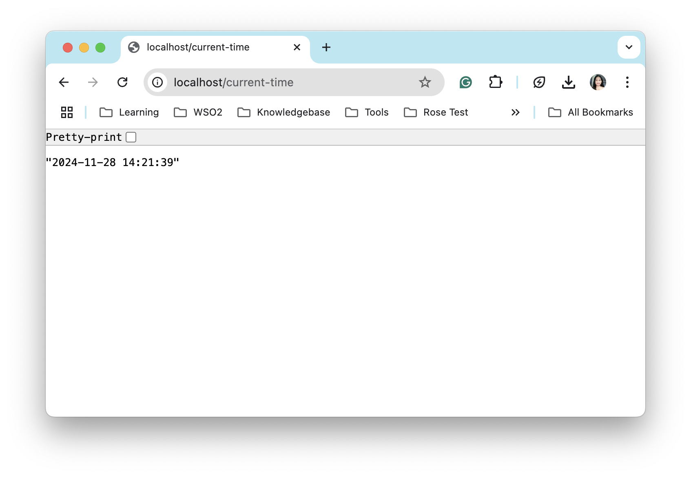
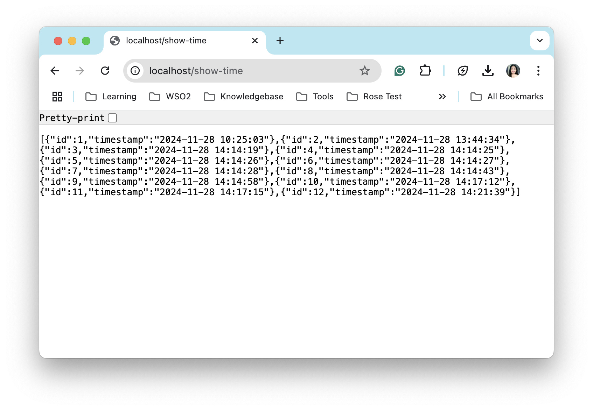

# Toronto Time API with MySQL Database Integration

This project implements a Go API that provides the current time in Toronto, and logs each request to a MySQL database. The project is Dockerized, and uses Docker Compose for easy deployment.

## Table of Contents
1. [Project Overview](#project-overview)
2. [Technologies Used](#technologies-used)
3. [Setup Instructions](#setup-instructions)
4. [API Endpoints](#api-endpoints)
5. [Database Setup](#database-setup)
6. [Running the Application](#running-the-application)
7. [Bonus Challenges](#bonus-challenges)
8. [Troubleshooting](#troubleshooting)
9. [License](#license)

## Project Overview

The Go API exposes two main endpoints:

- **`/current-time`**: Returns the current time in Toronto in JSON format and logs the time to a MySQL database.
- **`/show-time`**: Returns all the logged times from the database.

The application uses the Go programming language, MySQL for database management, and Docker for easy deployment.

## Technologies Used

- **Go (Golang)**: Programming language used to create the API and interact with MySQL.
- **MySQL**: Relational database to store time logs.
- **Docker**: To containerize the Go application and MySQL service.
- **Docker Compose**: To simplify multi-container deployment for the Go app and MySQL.
- **Time Zone Handling**: Go's `time` package for accurate time zone conversion to Toronto’s time zone.

## Setup Instructions

### 1. Clone the Repository

First, clone the project repository to your local machine.

```bash
git clone https://github.com/rsauri/winp2000_go_time
cd winp2000_go_time
```

### 2. Docker and Docker Compose Setup

This project is Dockerized using `Docker` and `Docker Compose`. Make sure you have Docker installed on your machine. You can follow the instructions for installation here:

- [Install Docker](https://docs.docker.com/get-docker/)
- [Install Docker Compose](https://docs.docker.com/compose/install/)

### 3. Set Up Environment Variables

Create a `.env` file in the project root (or use the `.env` template provided in the project). The `.env` file should contain the following environment variables:

```bash
DB_USER=root
DB_PASSWORD=admin
DB_HOST=mysql
DB_PORT=3306
DB_NAME=timedb
```

- `DB_USER`: MySQL username (default `root`)
- `DB_PASSWORD`: MySQL password (default `admin`)
- `DB_HOST`: Host of the MySQL database (default `mysql`)
- `DB_PORT`: Port for MySQL (default `3306`)
- `DB_NAME`: Name of the database (`timedb`)

### 4. MySQL Database Setup

MySQL will be automatically set up using Docker Compose. The MySQL container is configured with the following:

- Root password: `admin`
- Database: `timedb`

Docker Compose will create the `timedb` database and a table named `time_log` when the application is started.

### 5. Build and Run the Application

Run the following command to build and run the Go app and MySQL container using Docker Compose:

```bash
docker compose -f docker-compose.yml up -d
```

This will:
- Build the Go app.
- Set up the MySQL database container.
- Start the Go app server on port `80` and MySQL on port `3306`.

### 6. Access the API

Once the containers are up and running, you can access the API endpoints.

- **`/current-time`**: Get the current time in Toronto.
- **`/show-time`**: Retrieve all time entries from the database.

Example:
```bash
curl http://localhost:80/current-time
```

This will return a JSON object containing the current time in Toronto, and the time will be logged into the MySQL database.

### 7. Stopping the Containers

To stop the containers and clean up:

```bash
docker-compose down
```

This will stop and remove the containers.

## API Endpoints

- **GET `/current-time`**  
  Returns the current time in Toronto and logs it into the database.

  **Response Example:**
```json
  {
    "current_time": "2024-11-28 15:30:45"
  }
```

- **GET `/show-time`**  
  Retrieves all logged times from the database.

    **Response Example:**
```json
[
  {
    "id": 1,
    "timestamp": "2024-11-28 15:30:45"
  },
  {
    "id": 2,
    "timestamp": "2024-11-28 16:00:00"
  }
]
```

## Database Setup

MySQL will automatically set up the database `timedb` and a table `time_log` with the following schema:

```sql
CREATE TABLE time_log (
    id INT AUTO_INCREMENT PRIMARY KEY,
    timestamp VARCHAR(255) NOT NULL
);
```

Each time a request is made to the `/current-time` endpoint, the current time in Toronto will be logged into the `time_log` table.

## Running the Application

To run the application:

1. **Clone the repository.**
2. **Build and run the Docker containers** using `docker-compose up --build`.
3. **Access the API Endpoints**
    - `http://localhost/current-time`
    - `http://localhost/show-time`

### Test Results
1. **Run the docker containers and verify they are running**

```bash
docker compose -f docker-compose.yml up -d
```


2. **Test the `http://localhost/current-time`**
<div style="text-align: left;">

</div>

3. **Test the `http://localhost/show-time`**
<div style="text-align: left;">

</div>

